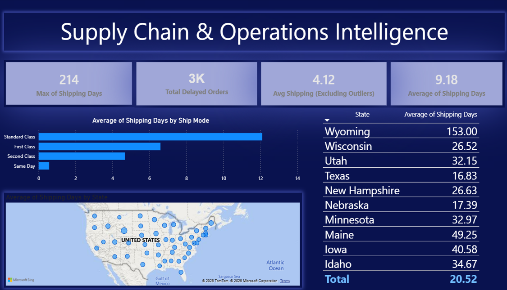

# Retail Supply Chain & Business Intelligence Platform

## Project Overview

This project transforms a fragmented, flat-file operational environment into an enterprise-grade Relational Database Management System (RDBMS) paired with an automated ETL pipeline and an interactive Power BI dashboard suite. By resolving structural data integrity issues and severe data duplication, the platform eliminates operational blind spots across fulfillment, marketing analytics, and executive leadership.

---

## Business Problem Statement

The organization previously managed over 9,800 transactional records across unnormalized flat files and Excel spreadsheets. This legacy approach caused critical business bottlenecks:

* System Performance & Integrity Risks: Unnormalized tables forced redundant entry of customer, location, and product data for every transaction, increasing system maintenance overhead and update anomaly risks.
* Operational Blind Spots: Supply chain leadership lacked visibility into transit delays and shipping variance across fulfillment channels.
* Fragmented Customer Analytics: Marketing teams were unable to compute Customer Lifetime Value (CLV) or execute behavioral customer segmentation across 793 unique accounts.

---

## Methodology: Google Data Analytics Life Cycle

### 1. Ask

Defined key business questions to align data engineering and reporting objectives with organizational strategy:

* How can we restructure transactional flat files into a scalable, non-redundant database architecture?
* Which logistical channels and geographic locations drive order fulfillment delays?
* How can customer purchasing behaviors be segmented to optimize marketing ROI and retention?

### 2. Prepare

Ingested and evaluated raw dataset properties (9,800 rows, 18 attributes):

* Imputed missing records in location attributes (Postal Code).
* Converted date attributes (`Order Date`, `Ship Date`) from raw text objects to standard SQL/Python Datetime formats.
* Standardized relational schemas to ensure strict data type constraints.

### 3. Process

Built a modular Python ETL script to clean raw transactions and engineer advanced metrics:

* Derived `Shipping Days` by calculating the exact difference between `Ship Date` and `Order Date`.
* Developed a Customer Lifetime Value (CLV) aggregation pipeline.
* Categorized customer accounts into three strategic behavioral tiers: VIP (> $5,000 CLV), Regular ($1,000 - $5,000 CLV), and Occasional (< $1,000 CLV).

### 4. Analyze

Utilized custom DAX measures in Power BI to construct dynamic analytical models:

* `Total_Customers = DISTINCTCOUNT('Cleaned_Data'[Customer ID])`
* `Average_CLV = DIVIDE(SUM('Cleaned_Data'[Sales]), [Total_Customers])`
* `Total_Orders = DISTINCTCOUNT('Cleaned_Data'[Order ID])`
* `Avg_Order_Value = DIVIDE(SUM('Cleaned_Data'[Sales]), [Total_Orders])`

### 5. Share

Designed a 3-page, interactive dark-mode dashboard suite tailored to executive, logistical, and marketing stakeholders.

### 6. Act

Formulated 6 data-backed strategic recommendations covering supply chain audits, carrier SLA renegotiations, VIP account management, and automated delta-load pipeline deployment.

---

## Database Architecture & Normalization

To eliminate data redundancy and support real-time analytical processing, the backend architecture was divided into two core environments:

* Operational Database (OLTP / 3NF): Decomposed flat-file data into Third Normal Form across distinct entities (`Customers`, `Locations`, `Products`, `Orders`, `OrderDetails`) to enforce referential integrity and eliminate update anomalies.
* Analytical Warehouse (OLAP / Star Schema): Structured target tables into a Star Schema centered around `Fact_Sales`, surrounded by primary dimensions (`Dim_Customer`, `Dim_Product`, `Dim_Location`, `Dim_Shipping`) for optimized Power BI query performance.

---

## Interactive Dashboards

### 1. Executive Performance Dashboard

Focuses on macro-level business health, overall revenue trajectories, and product category distribution.

* Top KPIs: Total Revenue ($2.25M), Total Unique Orders (4,916), Unique Customers (793), and Average Order Value ($458.22).
* Visuals: Yearly Sales Trend Line Chart capturing the 2016 contraction (-5.3%) and post-2017 surge (+31.4%), Regional Revenue Clustered Bar Chart (West and East driving 60%+ of sales), and Product Category Treemap.

### 2. Supply Chain & Operations Dashboard

Delivers granular operational visibility into shipping bottlenecks, delivery modes, and geographic fulfillment efficiency.

* Top KPIs: Overall Average Shipping Days (9.18 days), True Average Excluding Outliers (4.12 days), Total Delayed Orders (~3K), and Maximum Delivery Delay (214 days).
* Visuals: Average Shipping Days by Ship Mode Clustered Bar Chart, Geographic Bubble Map for state delays, and State Bottleneck Matrix highlighting Wyoming (153-day average).

### 3. Customer Intelligence & Segmentation Dashboard

Analyzes customer purchasing dynamics, high-value account retention, and product affinity by segment.

* Top KPIs: Total Unique Customers (793), Average CLV ($2.84K), and Top Revenue Account ("Sean Miller" at $25,043.05).
* Visuals: Customer Segment Donut Chart (63.18% Regular, 22.57% Occasional, 14.25% VIP), Segment-to-Category Flow Visual, Top Customer Spend Treemap, and Drill-Down Matrix Table.

---

## Strategic Recommendations

1. Conduct immediate operational audits on severe outlier locations, specifically Wyoming and states exceeding a 30-day average shipping duration.
2. Renegotiate Standard Class carrier contracts to reduce fulfillment times below 5 days.
3. Launch dedicated account management programs for the 113 VIP customers to protect $883K in revenue.
4. Re-engage Occasional buyers via targeted technology cross-selling campaigns.
5. Productionize the automated Python ETL pipeline to eliminate all manual spreadsheet maintenance.
6. Prioritize marketing allocation and inventory staging in the West and East regions.
